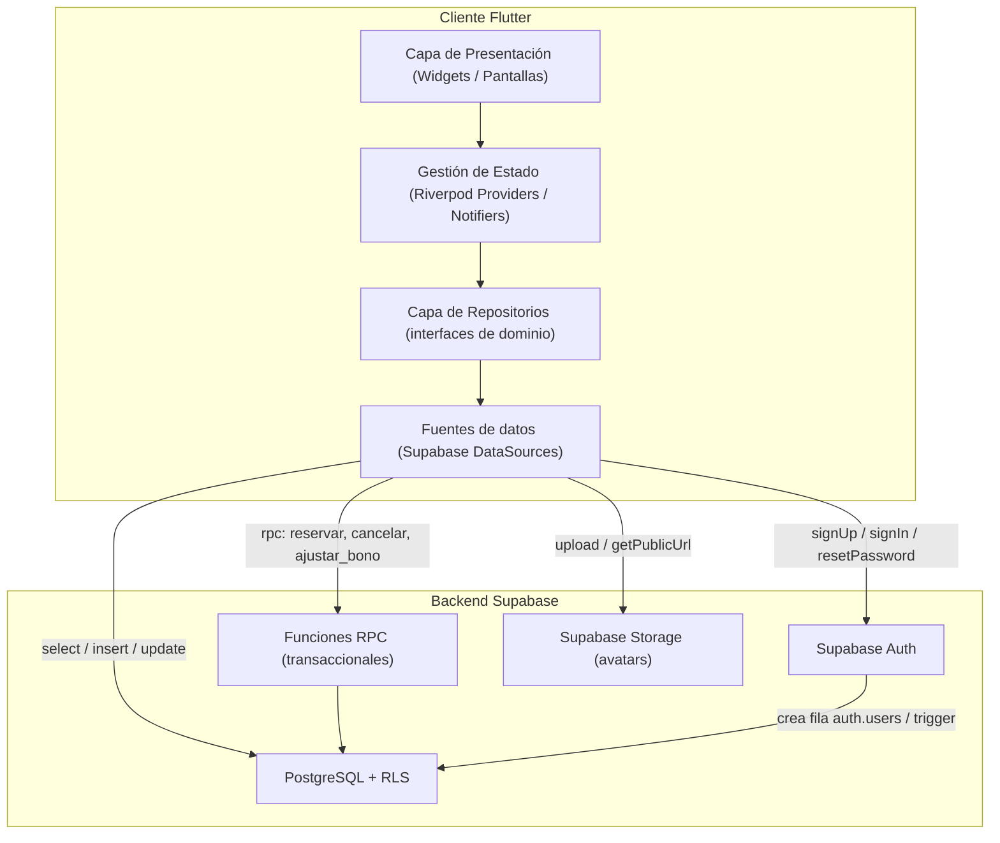

# Design Document

## Overview

Este documento describe el diseño técnico de la aplicación de gestión del gimnasio (nombre de trabajo: **Olympus**). La solución se compone de dos grandes piezas:

- **Cliente Flutter (Dart)**: aplicación móvil que ofrece la interfaz de usuario, el estado de la aplicación y la comunicación con el backend a través del SDK oficial de Supabase.
- **Backend Supabase**: proporciona autenticación (Supabase Auth), base de datos relacional (PostgreSQL), control de acceso a nivel de fila (Row Level Security, RLS) y almacenamiento de archivos (Supabase Storage) para las fotos de perfil.

La filosofía de diseño gira en torno a tres principios que responden al énfasis del usuario en que el modelo sea **ampliable y escalable**:

1. **La base de datos es la fuente de verdad y la última línea de defensa.** Las invariantes críticas (saldo del bono entre 0 y 10, máximo de 2 superadministradores, unicidad de reservas, aforo, antelación de cancelación) se garantizan mediante restricciones de PostgreSQL, políticas RLS y funciones transaccionales (RPC). El cliente nunca es la única barrera de seguridad ni de integridad.
2. **Atomicidad para las operaciones compuestas.** Las operaciones que modifican varias filas o dependen del estado actual (reservar, cancelar, promocionar desde lista de espera, ajustar bono) se implementan como funciones PostgreSQL (`SECURITY DEFINER` donde proceda) ejecutadas en una única transacción, invocadas desde el cliente mediante RPC. Esto evita condiciones de carrera (p. ej. dos usuarios reservando la última plaza).
3. **Modelo de datos extensible.** El registro de usuario se divide en una tabla `profiles` con los campos conocidos más una columna `metadata JSONB` para campos adicionales futuros, de modo que se puedan añadir atributos sin alterar la estructura existente (Requisito 3.5).

### Decisiones de diseño destacadas

| Decisión | Elección | Justificación |
|----------|----------|---------------|
| Gestión de estado en Flutter | **Riverpod** | Riverpod ofrece inyección de dependencias y proveedores testables sin acoplarse al árbol de widgets, lo que facilita escribir las pruebas y escalar por features. Es menos verboso que Bloc para un equipo pequeño y encaja bien con el modelo asíncrono de Supabase (`StreamProvider`/`FutureProvider`). Bloc sería una alternativa válida si se prioriza la separación estricta evento/estado. |
| Autenticación y recuperación de contraseña | **Supabase Auth** | Gestiona hashing de contraseñas, sesiones (JWT), y el flujo completo de restablecimiento con tokens de un solo uso y caducidad, cubriendo los Requisitos 1, 2, 7 y 9 sin reinventar criptografía. |
| Control de acceso | **RLS en PostgreSQL** | Empuja la autorización a la capa de base de datos (defensa en profundidad): aunque un bug del cliente intente leer datos ajenos, la política lo bloquea (Requisito 7). |
| Operaciones atómicas | **Funciones PostgreSQL + RPC** | Garantizan ACID y evitan condiciones de carrera en reservas y bono (Requisitos 4, 8). |
| Fotos de perfil | **Supabase Storage** | Almacenamiento de objetos con sus propias políticas RLS; la tabla `profiles` guarda solo la ruta/URL (Requisito 1.7). |
| Selección de imagen | **image_picker** | Paquete estándar para elegir foto desde cámara o galería. |

## Architecture

### Vista de alto nivel



### Capas del cliente Flutter

La aplicación sigue una **arquitectura por capas organizada por features** (Clean Architecture ligera) para favorecer la escalabilidad:

1. **Presentación (UI):** pantallas y widgets. No contiene lógica de negocio; observa proveedores de estado y despacha intenciones del usuario.
2. **Estado (Application):** `Notifier`/`AsyncNotifier` de Riverpod que orquestan casos de uso, exponen estados inmutables (cargando/éxito/error) y llaman a los repositorios.
3. **Dominio (Domain):** modelos de dominio e interfaces de repositorio (contratos). Independiente de Supabase para facilitar pruebas y futuras sustituciones.
4. **Datos (Data):** implementaciones de repositorio + *data sources* que hablan con el SDK de Supabase (Auth, Postgres, Storage, RPC) y mapean DTO ↔ modelos de dominio.

Esta separación cumple el espíritu del Requisito 3.5 y el objetivo de ampliabilidad: añadir una feature nueva (p. ej. pagos) consiste en crear un nuevo módulo bajo `features/` sin tocar los existentes.

### Estructura de carpetas recomendada (esqueleto del proyecto)

```text
lib/
├── main.dart                      # Punto de entrada; inicializa Supabase y ProviderScope
├── app.dart                       # MaterialApp, enrutado, tema
├── core/                          # Transversal, reutilizable por todas las features
│   ├── config/
│   │   ├── supabase_config.dart   # URL y anon key (desde env), inicialización
│   │   └── constants.dart         # Aforo por defecto, límites (BONO_MAX=10, WAITLIST_MAX=20)
│   ├── error/
│   │   └── failures.dart          # Tipos de error de dominio (AuthFailure, BonoFailure, ...)
│   ├── router/
│   │   └── app_router.dart        # Rutas y guardas de sesión
│   ├── theme/
│   └── utils/
│       └── validators.dart        # Validación de email y longitud de contraseña
├── features/
│   ├── auth/                      # Req 1, 2, 9
│   │   ├── data/
│   │   │   ├── datasources/auth_remote_datasource.dart
│   │   │   └── repositories/auth_repository_impl.dart
│   │   ├── domain/
│   │   │   ├── entities/app_user.dart
│   │   │   └── repositories/auth_repository.dart
│   │   └── presentation/
│   │       ├── providers/auth_providers.dart
│   │       └── screens/{login,register,forgot_password,reset_password}_screen.dart
│   ├── profile/                   # Req 3
│   │   ├── data/ domain/ presentation/
│   ├── bono/                      # Req 4
│   │   ├── data/ domain/ presentation/
│   ├── admin/                     # Req 5, 6 (gestión de usuarios y superadmins)
│   │   ├── data/ domain/ presentation/
│   └── reservas/                  # Req 8 (calendario, aforo, lista de espera)
│       ├── data/ domain/ presentation/
└── shared/
    ├── widgets/                   # Componentes UI reutilizables
    └── models/                    # Modelos compartidos entre features

supabase/                          # Artefactos de backend versionados
├── migrations/                    # SQL: tablas, constraints, RLS, funciones RPC
└── seed.sql                       # Datos de arranque (opcional)

test/                              # Pruebas unitarias y de propiedades
└── features/...
```

### Flujo de autenticación y sesión

- El registro, inicio de sesión, cierre de sesión y recuperación de contraseña se delegan en **Supabase Auth**. Supabase crea una fila en `auth.users` y gestiona el hashing de la contraseña y los JWT de sesión.
- Un **trigger** `on_auth_user_created` crea automáticamente la fila correspondiente en `public.profiles` con `saldo_clases = 10` y `estado = 'activo'`.
- El cliente escucha `supabase.auth.onAuthStateChange` para dirigir el enrutado (sesión activa vs. pantallas públicas), cumpliendo el Requisito 7.3 (sin sesión no hay acceso a datos).

## Components and Interfaces

### Servicios de dominio (mapeo lógico a los componentes del glosario)

Los "servicios" del glosario se materializan como repositorios en el cliente respaldados por tablas, políticas RLS y funciones RPC en el backend.

#### Servicio_Autenticacion (`AuthRepository`)
```dart
abstract class AuthRepository {
  Future<AppUser> signUp({required String nombre, required String apellidos,
      required String email, required String password, XFile? foto});
  Future<AppUser> signIn({required String email, required String password});
  Future<void> signOut();
  Future<void> requestPasswordReset(String email); // Req 9.1/9.2 (mensaje genérico)
  Future<void> updatePasswordWithToken(String newPassword); // Req 9.6/9.7
  Stream<AuthState> authStateChanges();
}
```
- `signUp` valida formato de email (Req 1.5) y longitud de contraseña ≥ 8 (Req 1.6) antes de llamar a Supabase Auth; delega el hashing y el control de email duplicado (Req 1.4) a Auth.
- `signIn` traduce errores de Supabase a mensajes de credenciales inválidas (Req 2.2) o cuenta suspendida (Req 2.3). La comprobación de estado "suspendido" se refuerza con una política/validación en backend.

#### Servicio_Usuarios (`ProfileRepository`)
```dart
abstract class ProfileRepository {
  Future<Profile> getMyProfile();                 // Req 3.1
  Future<Profile> updateMyProfile({String? nombre, String? apellidos, XFile? foto}); // Req 3.2
}
```
- No expone métodos para que el usuario estándar cambie su `saldo_clases` ni su `estado`; además las políticas RLS impiden esas columnas (Req 3.3, 3.4).

#### Servicio_Bono (`BonoRepository`)
```dart
abstract class BonoRepository {
  Future<int> getSaldo();                          // Req 4.1
}
```
- La modificación del saldo nunca ocurre por `update` directo del cliente: siempre a través de RPC (`reservar_clase`, `cancelar_reserva`, `ajustar_bono`, `restablecer_bono`).

#### Servicio_Administracion (`AdminRepository`)
```dart
abstract class AdminRepository {
  Future<List<Profile>> listUsers();               // Req 6.1
  Future<void> suspendUser(String userId);         // Req 6.2
  Future<void> reactivateUser(String userId);      // Req 6.3
  Future<void> deleteUser(String userId);          // Req 6.4
  Future<void> restablecerBono(String userId);     // Req 6.5
  Future<void> ajustarBono(String userId, int valor); // Req 6.6
  Future<void> grantSuperadmin(String userId);     // Req 5.1/5.2
}
```
- Todas estas operaciones se implementan como RPC con comprobación de rol de superadministrador en el backend (Req 5.3, 5.4). `deleteUser` rechaza la autoeliminación (Req 6.7).

#### Servicio_Reservas (`ReservasRepository`)
```dart
abstract class ReservasRepository {
  Future<List<Clase>> getCalendario({DateTime? desde, DateTime? hasta});
  Future<Clase> crearClase({required DateTime horario, required int aforo, required String monitor}); // Req 8.1
  Future<Clase> editarClase(String claseId, {...});   // Req 8.1
  Future<void> eliminarClase(String claseId);         // Req 8.1
  Future<ReservaResult> reservar(String claseId);     // Req 8.3/8.4/8.5/8.6/8.12 (RPC atómica)
  Future<void> cancelar(String claseId);              // Req 8.7/8.8/8.9/8.11 (RPC atómica)
}
```

### Funciones RPC del backend (contratos lógicos)

| Función RPC | Responsabilidad | Requisitos |
|-------------|-----------------|------------|
| `reservar_clase(clase_id)` | En una transacción: valida saldo > 0; si hay aforo libre crea `Reserva_Confirmada` y decrementa el bono en 1; si está lleno añade a la lista de espera (si < 20) sin tocar el bono; rechaza duplicados. | 8.3, 8.4, 8.5, 8.6, 8.12 |
| `cancelar_reserva(clase_id)` | En una transacción: si es reserva confirmada, libera la plaza; reembolsa 1 solo si faltan ≥ 2h; luego intenta promocionar al primero de la lista de espera con saldo > 0. Si era entrada en lista de espera, la elimina sin tocar el bono. | 8.7, 8.8, 8.9, 8.11 |
| `ajustar_bono(user_id, valor)` | Valida rol superadmin y `0 ≤ valor ≤ 10`; fija el saldo. | 6.6 |
| `restablecer_bono(user_id)` | Valida rol superadmin; fija el saldo en 10. | 6.5 |
| `suspender_usuario / reactivar_usuario / eliminar_usuario` | Valida rol superadmin; cambia estado o elimina; `eliminar_usuario` rechaza autoeliminación de superadmin. | 6.2, 6.3, 6.4, 6.7 |
| `conceder_superadmin(user_id)` | Valida rol superadmin y que haya menos de 2 superadmins antes de asignar. | 5.1, 5.2 |

La promoción desde la lista de espera (Req 8.9) ocurre **dentro** de la transacción de `cancelar_reserva`, de modo que la liberación de plaza y la promoción son atómicas y no quedan plazas "huérfanas".

## Data Models

### Diagrama entidad-relación

```mermaid
erDiagram
    AUTH_USERS ||--|| PROFILES : "1:1 (id)"
    PROFILES ||--o{ RESERVAS : "realiza"
    CLASES   ||--o{ RESERVAS : "contiene"

    AUTH_USERS {
        uuid id PK
        text email
        text encrypted_password
    }
    PROFILES {
        uuid id PK_FK
        text nombre
        text apellidos
        text foto_url
        int  saldo_clases
        text estado
        text rol
        jsonb metadata
        timestamptz created_at
    }
    CLASES {
        uuid id PK
        timestamptz horario
        int aforo
        text monitor
        uuid created_by FK
    }
    RESERVAS {
        uuid id PK
        uuid clase_id FK
        uuid user_id FK
        text status
        int posicion
        timestamptz created_at
    }
```

### Tabla `profiles` (extiende `auth.users`)

Modelo de usuario **ampliable**: columnas explícitas para los campos conocidos + `metadata JSONB` para extensiones futuras (Req 3.5).

| Columna | Tipo | Restricciones | Notas |
|---------|------|---------------|-------|
| `id` | `uuid` | PK, FK → `auth.users(id)` ON DELETE CASCADE | Mismo id que la cuenta de Auth |
| `nombre` | `text` | NOT NULL | Req 1.1 |
| `apellidos` | `text` | NOT NULL | Req 1.1 |
| `foto_url` | `text` | NULL | Ruta en Storage (Req 1.7) |
| `email` | `text` | NOT NULL, UNIQUE | Espejo de `auth.users.email` para listados admin |
| `saldo_clases` | `int` | NOT NULL, DEFAULT 10, `CHECK (saldo_clases BETWEEN 0 AND 10)` | Invariante del bono (Req 1.2, 4.4, 8.10) |
| `estado` | `text` | NOT NULL, DEFAULT 'activo', `CHECK (estado IN ('activo','suspendido'))` | Req 1.1, 6.2, 6.3 |
| `rol` | `text` | NOT NULL, DEFAULT 'usuario', `CHECK (rol IN ('usuario','superadmin'))` | Req 5 |
| `metadata` | `jsonb` | NOT NULL, DEFAULT '{}'::jsonb | Campos ampliables (Req 3.5) |
| `created_at` | `timestamptz` | NOT NULL, DEFAULT now() | |

**Invariante de máximo 2 superadministradores (Req 5.1):** se refuerza con un índice parcial único sobre una columna generada, o con una tabla auxiliar/validación en la función RPC. Patrón recomendado:

```sql
-- Índice parcial que numera superadmins mediante una columna de "slot"
-- (0 ó 1); un unique index garantiza como mucho 2 ocupados.
-- Alternativa robusta: validación dentro de conceder_superadmin() contando filas.
```
La forma más fiable es validar el conteo dentro de `conceder_superadmin()` en una transacción con bloqueo (`SELECT ... FOR UPDATE`), lo que evita condiciones de carrera al conceder el rol.

### Tabla `clases`

| Columna | Tipo | Restricciones | Notas |
|---------|------|---------------|-------|
| `id` | `uuid` | PK, DEFAULT gen_random_uuid() | |
| `horario` | `timestamptz` | NOT NULL | `Horario_Clase` (Req 8.1) |
| `aforo` | `int` | NOT NULL, `CHECK (aforo BETWEEN 1 AND 10)` | Límite configurable, actualmente 10 (Req 8.1) |
| `monitor` | `text` | NOT NULL | Monitor asignado (Req 8.1) |
| `created_by` | `uuid` | FK → `profiles(id)` | Superadmin creador |
| `created_at` | `timestamptz` | NOT NULL, DEFAULT now() | |

### Tabla `reservas` (reserva + lista de espera unificadas)

Se modela la reserva y la lista de espera en una sola tabla con un campo `status`, lo que simplifica la promoción atómica y las consultas de aforo.

| Columna | Tipo | Restricciones | Notas |
|---------|------|---------------|-------|
| `id` | `uuid` | PK, DEFAULT gen_random_uuid() | |
| `clase_id` | `uuid` | NOT NULL, FK → `clases(id)` ON DELETE CASCADE | |
| `user_id` | `uuid` | NOT NULL, FK → `profiles(id)` ON DELETE CASCADE | |
| `status` | `text` | NOT NULL, `CHECK (status IN ('confirmada','espera'))` | `Reserva_Confirmada` o `Lista_De_Espera` |
| `posicion` | `int` | NULL (solo para `espera`) | Orden FIFO en la lista de espera (Req 8.5, 8.9) |
| `created_at` | `timestamptz` | NOT NULL, DEFAULT now() | Desempate de orden |
| — | — | `UNIQUE (clase_id, user_id)` | Una entrada por usuario y clase (Req 8.6) |

Restricciones e invariantes de integridad:
- El número de filas `status='confirmada'` para una `clase_id` nunca supera el `aforo` de esa clase (validado en `reservar_clase` / promoción).
- El número de filas `status='espera'` para una `clase_id` nunca supera 20 (`Lista_De_Espera_Maxima`, Req 8.12).

### Tokens de restablecimiento (Req 9)

Los `Token_Restablecimiento` **no** se modelan en tablas propias: son gestionados internamente por **Supabase Auth**, que ya garantiza caducidad (configurable a 60 minutos, Req 9.3), un solo uso (Req 9.5/9.9) e invalidación de sesiones tras el cambio (Req 9.8). El diseño solo configura la expiración y maneja los errores devueltos por Auth.

### Supabase Storage

- Bucket `avatars` para las fotos de perfil. La tabla `profiles.foto_url` almacena la ruta.
- Políticas de Storage: cada usuario puede subir/actualizar su propio avatar; lectura según se decida (bucket público para CDN o URLs firmadas).

## Security and RLS Strategy (Requisito 7)

Estrategia de RLS que mapea directamente al Requisito 7 (y refuerza 3.3, 3.4, 5.4, 8.2):

- **Sin sesión, sin datos (Req 7.3):** `GRANT` mínimo + RLS activado en todas las tablas. El rol `anon` no tiene políticas de lectura sobre datos de usuario, por lo que un cliente sin JWT no obtiene filas.
- **Un usuario solo ve lo suyo (Req 7.2):** política `SELECT` sobre `profiles` con `USING (auth.uid() = id OR es_superadmin())`.
- **El usuario no modifica saldo/estado (Req 3.3, 3.4):** política `UPDATE` sobre `profiles` con `WITH CHECK` que restringe las columnas modificables a `nombre`, `apellidos`, `foto_url` y `metadata`; `saldo_clases`, `estado` y `rol` solo cambian vía funciones `SECURITY DEFINER`.
- **Superadmin ve/gestiona todo (Req 6):** función auxiliar `es_superadmin()` que lee el `rol` del `profile` del llamante, usada en las políticas y en las RPC administrativas.
- **Clases:** lectura para cualquier usuario autenticado; escritura (INSERT/UPDATE/DELETE) solo si `es_superadmin()` (Req 8.1, 8.2).
- **Reservas:** un usuario ve y crea/borra solo sus propias reservas; la mutación real pasa por RPC para preservar la atomicidad y las invariantes.

Las funciones que deben saltarse RLS de forma controlada (p. ej. promocionar lista de espera que toca filas de otros usuarios) se declaran `SECURITY DEFINER` con comprobaciones explícitas de autorización en su cuerpo.

## Correctness Properties

*Una propiedad es una característica o comportamiento que debe cumplirse en todas las ejecuciones válidas de un sistema; esencialmente, una afirmación formal sobre lo que el sistema debe hacer. Las propiedades son el puente entre la especificación legible por humanos y las garantías de corrección verificables por máquina.*

Las siguientes propiedades se derivan del análisis de prework. Se han consolidado para eliminar redundancias (p. ej. la invariante del saldo de 4.4 y 8.10, el hashing de 1.3/2.5/7.1/9.7, y la validación de longitud de 1.6/9.6).

### Property 1: Inicialización del bono y estado al registrarse

*Para cualquier* registro de usuario válido, la cuenta creada debe tener `estado == 'activo'` y `saldo_clases == 10`.

**Validates: Requirements 1.1, 1.2**

### Property 2: La invariante del saldo se mantiene en 0..10

*Para cualquier* usuario y *cualquier* secuencia de operaciones de bono (asistencia, reserva, cancelación con o sin reembolso, ajuste o restablecimiento por superadmin), el `saldo_clases` resultante siempre cumple `0 <= saldo_clases <= 10`.

**Validates: Requirements 4.4, 8.10**

### Property 3: Las contraseñas nunca se almacenan ni comparan en texto plano

*Para cualquier* contraseña proporcionada en el registro o en el restablecimiento, el valor persistido nunca es igual a la contraseña en texto plano ni la contiene, y la verificación de credenciales nunca utiliza el texto plano persistido.

**Validates: Requirements 1.3, 2.5, 7.1, 9.7**

### Property 4: El email duplicado se rechaza

*Para cualquier* email ya asociado a un usuario existente, un segundo intento de registro con ese mismo email se rechaza y no crea una segunda cuenta.

**Validates: Requirements 1.4**

### Property 5: El formato de email inválido se rechaza

*Para cualquier* cadena que no cumpla el formato de una dirección de correo válida, el registro se rechaza con un error de formato de correo.

**Validates: Requirements 1.5**

### Property 6: La contraseña demasiado corta se rechaza

*Para cualquier* contraseña de longitud menor que ocho (8) caracteres, el registro y el restablecimiento se rechazan con un error de longitud de contraseña.

**Validates: Requirements 1.6, 9.6**

### Property 7: El usuario suspendido no puede iniciar sesión ni restablecer su contraseña

*Para cualquier* usuario con `estado == 'suspendido'`, tanto el inicio de sesión como el restablecimiento de contraseña se rechazan con un mensaje de cuenta suspendida.

**Validates: Requirements 2.3, 9.10**

### Property 8: Round trip de actualización de perfil

*Para cualquier* conjunto válido de nuevos valores de `nombre`, `apellidos` o `foto`, actualizar el perfil y luego releerlo devuelve exactamente los valores escritos.

**Validates: Requirements 3.2**

### Property 9: El usuario estándar no puede modificar su saldo ni su estado

*Para cualquier* usuario con rol estándar y *cualquier* intento de modificar su propio `saldo_clases` o su propio `estado`, la operación se rechaza y ambos valores permanecen inalterados.

**Validates: Requirements 3.3, 3.4**

### Property 10: El modelo de usuario es ampliable (preservación de metadata)

*Para cualquier* objeto JSON arbitrario añadido a `metadata`, al guardarlo y releer el perfil los campos conocidos permanecen intactos y el contenido de `metadata` se preserva íntegramente (round trip).

**Validates: Requirements 3.5**

### Property 11: El consumo de bono decrementa exactamente en 1

*Para cualquier* usuario con `saldo_clases > 0`, registrar la asistencia a una clase deja `saldo_clases' == saldo_clases - 1`.

**Validates: Requirements 4.2**

### Property 12: Como máximo dos superadministradores

*Para cualquier* secuencia de concesiones del rol de superadministrador, el número de usuarios con `rol == 'superadmin'` nunca supera dos (2); todo intento de conceder el rol cuando ya existen dos se rechaza.

**Validates: Requirements 5.1, 5.2**

### Property 13: El usuario estándar es denegado en operaciones de gestión

*Para cualquier* usuario con rol estándar y *cualquier* operación de gestión de usuarios, el acceso se deniega con un mensaje de autorización insuficiente.

**Validates: Requirements 5.4**

### Property 14: Suspender y reactivar (round trip de estado)

*Para cualquier* usuario, suspenderlo fija su `estado` en `'suspendido'`, y reactivarlo a continuación lo restaura a `'activo'`.

**Validates: Requirements 6.2, 6.3**

### Property 15: La eliminación de un usuario borra su registro

*Para cualquier* usuario, tras su eliminación por un superadministrador el registro deja de existir en la base de datos.

**Validates: Requirements 6.4**

### Property 16: Restablecer el bono fija el saldo en 10

*Para cualquier* usuario con *cualquier* saldo previo, restablecer su bono deja `saldo_clases == 10`.

**Validates: Requirements 6.5**

### Property 17: Ajustar el saldo fija el valor solicitado y rechaza fuera de rango

*Para cualquier* valor entero en el rango 0..10, ajustar el saldo de un usuario deja `saldo_clases == valor`; *para cualquier* valor fuera de 0..10 la operación se rechaza y el saldo no cambia.

**Validates: Requirements 6.6**

### Property 18: Un superadministrador no puede autoeliminarse

*Para cualquier* superadministrador, el intento de eliminar su propia cuenta se rechaza y la cuenta persiste.

**Validates: Requirements 6.7**

### Property 19: Un usuario solo accede a sus propios datos (salvo superadmin)

*Para cualquier* par de usuarios (solicitante, objetivo) donde el solicitante no es el objetivo ni un superadministrador, la petición de los datos del objetivo se deniega.

**Validates: Requirements 7.2**

### Property 20: Sin sesión no hay acceso a datos de usuario

*Para cualquier* petición de datos de usuario sin una sesión activa, el acceso se deniega (no se devuelve ninguna fila).

**Validates: Requirements 7.3**

### Property 21: El aforo de una clase está en el rango 1..10

*Para cualquier* clase creada o editada por un superadministrador, su `aforo` se acepta si y solo si `1 <= aforo <= 10`; valores fuera de rango se rechazan.

**Validates: Requirements 8.1**

### Property 22: El usuario estándar no puede modificar clases

*Para cualquier* usuario con rol estándar y *cualquier* intento de crear, editar o eliminar una clase, la operación se deniega y la clase no se modifica.

**Validates: Requirements 8.2**

### Property 23: Reserva con plaza libre crea confirmada y descuenta exactamente 1

*Para cualquier* clase cuyo aforo no está completo y *cualquier* usuario con `saldo_clases > 0`, reservar crea una `Reserva_Confirmada` para ese usuario y deja `saldo_clases' == saldo_clases - 1`.

**Validates: Requirements 8.3**

### Property 24: Reserva en clase llena añade al final de la lista de espera sin tocar el saldo

*Para cualquier* clase con aforo completo cuya lista de espera tiene menos de veinte (20) entradas, y *cualquier* usuario con `saldo_clases > 0` sin reserva previa, reservar añade al usuario al final de la lista de espera (orden FIFO) y deja su `saldo_clases` sin cambios.

**Validates: Requirements 8.5**

### Property 25: No se permiten reservas ni entradas de espera duplicadas

*Para cualquier* usuario que ya tiene una reserva o figura en la lista de espera de una clase, un nuevo intento de reservar esa clase se rechaza y no crea una entrada duplicada (como máximo una fila por par usuario-clase).

**Validates: Requirements 8.6**

### Property 26: El reembolso al cancelar ocurre si y solo si la antelación es ≥ 2 horas

*Para cualquier* reserva confirmada que se cancela, la plaza se libera siempre; el `saldo_clases` se incrementa en exactamente 1 si la cancelación ocurre con dos (2) horas o más de antelación respecto al `Horario_Clase`, y permanece inalterado si ocurre con menos de 2 horas.

**Validates: Requirements 8.7, 8.8**

### Property 27: Al liberarse una plaza se promociona al primero de la espera con saldo > 0 y se descuenta 1

*Para cualquier* clase con la lista de espera no vacía en la que se libera una plaza, el primer usuario de la lista (FIFO) con `saldo_clases > 0` pasa a `Reserva_Confirmada` y su `saldo_clases` se reduce en exactamente 1.

**Validates: Requirements 8.9**

### Property 28: Cancelar estando en lista de espera no afecta al saldo

*Para cualquier* usuario que figura en la lista de espera de una clase, cancelar su solicitud elimina su entrada de la lista de espera y deja su `saldo_clases` sin cambios.

**Validates: Requirements 8.11**

### Property 29: La solicitud de restablecimiento devuelve siempre un mensaje genérico

*Para cualquier* email (exista o no una cuenta asociada), la respuesta a una solicitud de restablecimiento de contraseña es el mismo mensaje genérico, sin revelar si el email corresponde a una cuenta.

**Validates: Requirements 9.1**

### Property 30: Rechazo de reserva por saldo cero y por lista de espera llena (casos borde)

*Para cualquier* usuario con `saldo_clases == 0`, reservar cualquier clase se rechaza sin crear reserva ni entrada en lista de espera; y *para cualquier* clase con aforo completo y lista de espera con exactamente veinte (20) entradas, reservar se rechaza con mensaje de lista de espera completa.

**Validates: Requirements 4.3, 8.4, 8.12**

## Error Handling

El manejo de errores sigue una estrategia por capas que convierte fallos técnicos en mensajes de dominio claros, cumpliendo los mensajes exigidos por los requisitos.

- **Capa de datos (DataSources):** captura excepciones del SDK de Supabase (`AuthException`, `PostgrestException`, `StorageException`) y errores de RPC (que lanzan `RAISE EXCEPTION` con códigos/mensajes específicos desde PostgreSQL).
- **Capa de repositorio:** traduce esas excepciones a `Failure` de dominio tipados:
  - `EmailEnUsoFailure` (Req 1.4), `FormatoEmailFailure` (Req 1.5), `PasswordCortaFailure` (Req 1.6, 9.6).
  - `CredencialesInvalidasFailure` (Req 2.2), `CuentaSuspendidaFailure` (Req 2.3, 9.10).
  - `SinClasesFailure` (Req 4.3, 8.4), `ListaEsperaLlenaFailure` (Req 8.12), `ReservaDuplicadaFailure` (Req 8.6).
  - `AutorizacionInsuficienteFailure` (Req 5.4, 7.2, 8.2), `MaxSuperadminsFailure` (Req 5.2), `AutoeliminacionFailure` (Req 6.7).
  - `TokenInvalidoFailure` (Req 9.4, 9.5).
- **Capa de estado/UI:** los `Notifier` exponen estados de error que la UI muestra como mensajes localizados en español. Nunca se muestran trazas técnicas al usuario.
- **Errores desde RPC/PostgreSQL:** cada función RPC usa `RAISE EXCEPTION USING ERRCODE/MESSAGE` para señalar condiciones de negocio (saldo cero, lista llena, duplicado, autorización), garantizando que la validación crítica ocurre en el backend aunque el cliente la omita.
- **Mensaje genérico de recuperación (Req 9.1):** la capa de autenticación nunca propaga si el email existe; devuelve siempre el mismo mensaje con independencia del resultado real de Supabase Auth.

## Testing Strategy

La estrategia combina pruebas basadas en propiedades (PBT) para la lógica de negocio con pruebas de ejemplo e integración para los flujos y la infraestructura.

### Pruebas basadas en propiedades (property-based testing)

PBT es apropiado aquí porque la lógica del bono, las reservas, la lista de espera y las reglas de autorización son funciones con comportamiento universal verificable sobre un amplio espacio de entradas.

- **Librería:** se usará `fast_check` ejecutado sobre la lógica de dominio portada/espejada, o la combinación de `glados` (property testing para Dart) con `flutter_test` en el cliente. Para la lógica de reservas/bono implementada como funciones puras de dominio (modelo en memoria que refleja las RPC), se escriben pruebas de propiedad en Dart con `glados`. **No** se implementará el motor de PBT desde cero.
- **Modelo de dominio testable:** las reglas de reserva/cancelación/promoción y del bono se encapsulan en funciones puras de dominio (un "modelo" en memoria equivalente a las RPC). Las pruebas de propiedad validan ese modelo; pruebas de integración separadas verifican que las RPC de PostgreSQL se comportan igual.
- **Configuración:** cada prueba de propiedad ejecuta un **mínimo de 100 iteraciones**.
- **Trazabilidad:** cada prueba de propiedad lleva un comentario con el formato
  **Feature: gym-management-app, Property {número}: {texto de la propiedad}**
- **Cobertura:** se implementa una única prueba de propiedad por cada propiedad de la sección Correctness Properties (Propiedades 1-30). Los generadores cubren explícitamente los casos borde (saldo == 0, lista de espera == 20, antelación justo en 2h, aforo en los extremos 1 y 10) descritos en las propiedades 30, 26 y 21.

### Pruebas de ejemplo (unit tests)

Para criterios no universales o flujos concretos:
- Login correcto establece sesión (2.1), logout finaliza sesión (2.4), lectura de perfil propio (3.1), lectura de saldo (4.1), listado de usuarios por superadmin (6.1), acceso de superadmin a gestión (5.3), asociación de foto en registro (1.7).

### Pruebas de integración

Para comportamiento gestionado por Supabase Auth/Storage e infraestructura (no aptas para PBT):
- Envío del enlace de restablecimiento (9.2), caducidad de token a 60 min (9.3), token caducado (9.4), token ya usado / consumido (9.5, 9.9), invalidación de sesiones tras reset (9.8).
- Verificación de que las políticas RLS deniegan acceso anónimo y cruzado contra una instancia real/local de Supabase (refuerzo de las propiedades 19 y 20).
- Verificación de que las funciones RPC (`reservar_clase`, `cancelar_reserva`) producen los mismos resultados que el modelo de dominio bajo concurrencia (prueba de condición de carrera para la última plaza).

### Pruebas de widget / snapshot

Para la capa de presentación Flutter: pruebas de widget de las pantallas de login, registro, perfil, calendario y panel de administración, verificando estados de carga/éxito/error y el renderizado de los campos esperados.
